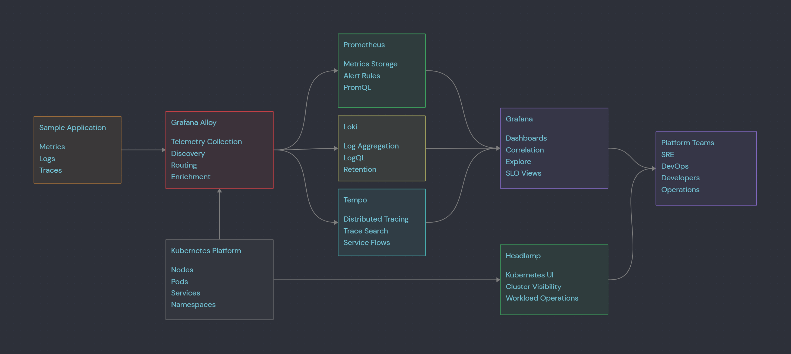
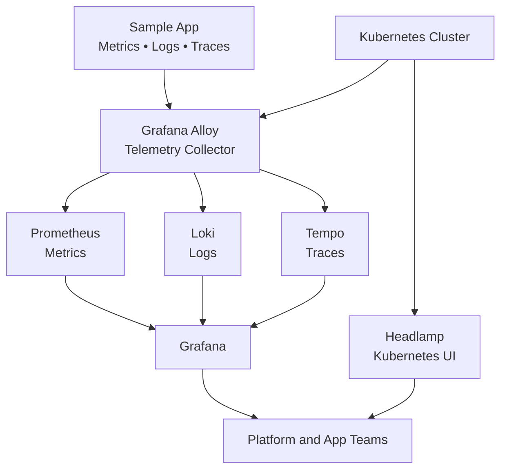

# Enterprise Observability Platform

**Grafana | Prometheus | Loki | Tempo | Grafana Alloy | Headlamp | OpenTelemetry | Kubernetes**

This repository is an architecture-first observability platform portfolio with deployable reference code.

It includes:

- Grafana for dashboards and exploration
- Prometheus for metrics
- Loki for logs
- Tempo for distributed traces
- Grafana Alloy as the telemetry collector
- Headlamp for Kubernetes visibility
- A sample app that emits metrics, logs, and traces


---
## Enterprise Observability Platform



## Architecture



---

## Repository Structure

```text
.
├── README.md
├── docs/
│   ├── architecture.md
│   ├── telemetry-flow.md
│   ├── production-readiness.md
│   └── troubleshooting.md
├── app/
│   ├── main.py
│   ├── requirements.txt
│   └── Dockerfile
├── charts/
│   └── sample-otel-app/
├── platform/
│   ├── namespace.yaml
│   ├── grafana-values.yaml
│   ├── prometheus-values.yaml
│   ├── loki-values.yaml
│   ├── tempo-values.yaml
│   ├── alloy-values.yaml
│   ├── headlamp-values.yaml
│   └── dashboard-configmap.yaml
├── dashboards/
│   └── sample-app-dashboard.json
├── diagrams/
│   ├── observability-platform.mmd
│   └── observability-platform.canvas
└── scripts/
    ├── 00-add-helm-repos.sh
    ├── 01-install-observability.sh
    ├── 02-build-sample-app.sh
    ├── 03-deploy-sample-app.sh
    ├── 04-port-forward.sh
    └── 05-generate-traffic.sh
```

---

## Component Map

| Component | Purpose |
|---|---|
| Grafana | Dashboards, Explore, visual correlation |
| Prometheus | Metrics collection and PromQL |
| Loki | Log aggregation and LogQL |
| Tempo | Distributed trace backend |
| Grafana Alloy | Collects and routes metrics, logs, and traces |
| Headlamp | Kubernetes workload visibility |
| Sample App | Emits metrics, structured logs, and OpenTelemetry traces |

---

## Quick Start

```bash
./scripts/00-add-helm-repos.sh
./scripts/01-install-observability.sh
./scripts/02-build-sample-app.sh
./scripts/03-deploy-sample-app.sh
./scripts/04-port-forward.sh
./scripts/05-generate-traffic.sh
```

For kind clusters, after building the image:

```bash
kind load docker-image sample-otel-app:1.0.0
```

---

## Local Access

After port-forwarding:

| Tool | URL |
|---|---|
| Grafana | `http://127.0.0.1:3000` |
| Headlamp | `http://127.0.0.1:4466` |
| Sample App | `http://127.0.0.1:8080` |

Grafana demo credentials are configured in `platform/grafana-values.yaml`.

---

## Sample App Endpoints

| Endpoint | Purpose |
|---|---|
| `/` | App overview |
| `/health` | Health check |
| `/work` | Emits logs, metrics, and traces |
| `/error` | Emits error logs and error traces |
| `/metrics` | Prometheus metrics |

---

## Example Queries

### Prometheus

```promql
sample_app_requests_total
rate(sample_app_requests_total[5m])
histogram_quantile(0.95, rate(sample_app_request_duration_seconds_bucket[5m]))
```

### Loki

```logql
{app="sample-otel-app"}
{app="sample-otel-app"} |= "error"
```

### Tempo

Use Grafana Explore → Tempo datasource and search for:

```text
sample-otel-app
```

---

## Portfolio Value

This repo demonstrates:

- Observability architecture
- OpenTelemetry application instrumentation
- Kubernetes telemetry collection
- Metrics, logs, and traces
- Grafana Alloy collection pipeline
- Platform troubleshooting model
- Kubernetes visibility with Headlamp
- Architecture documentation plus working code
